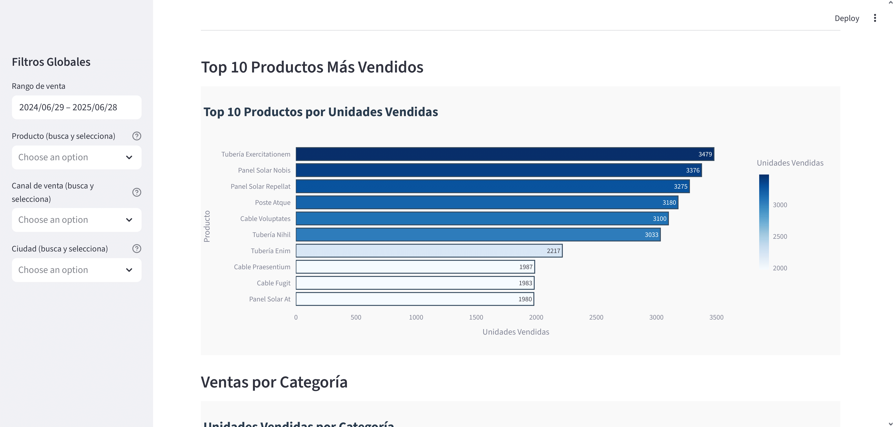
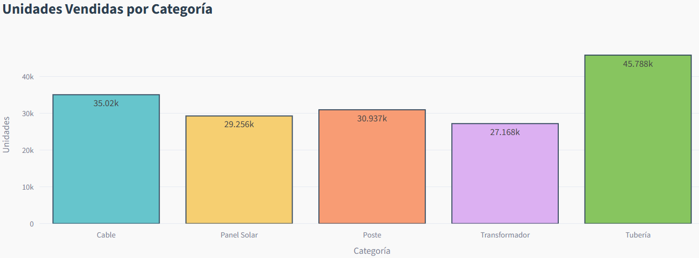
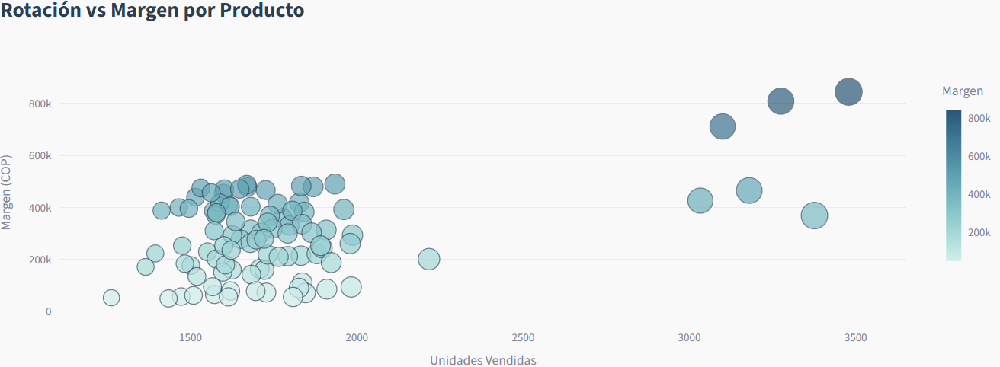
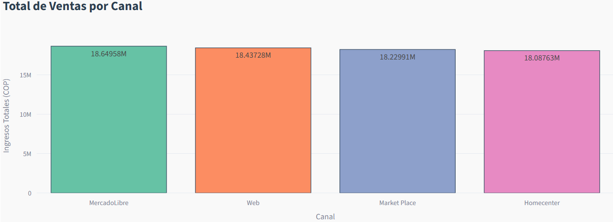
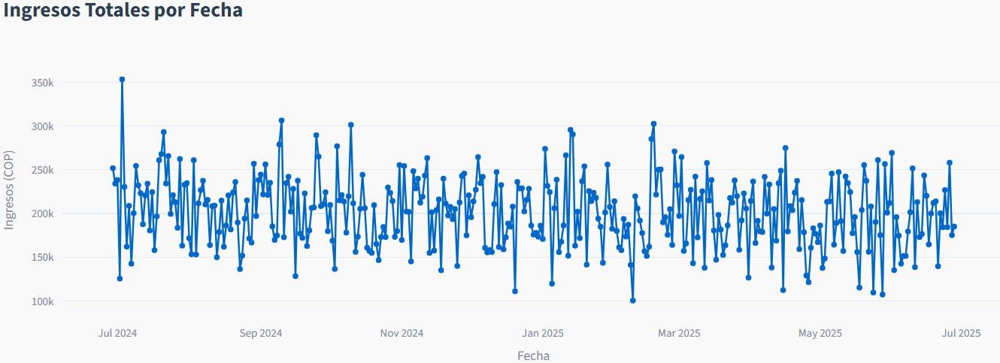
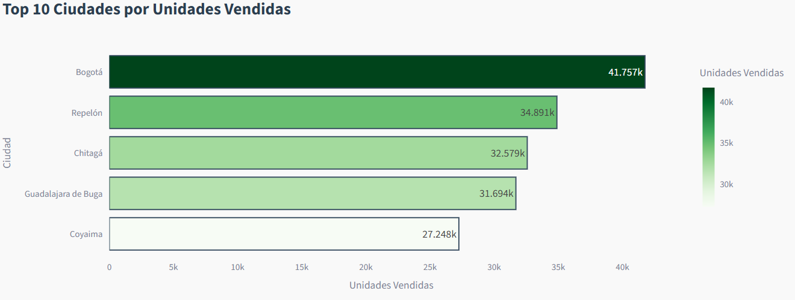
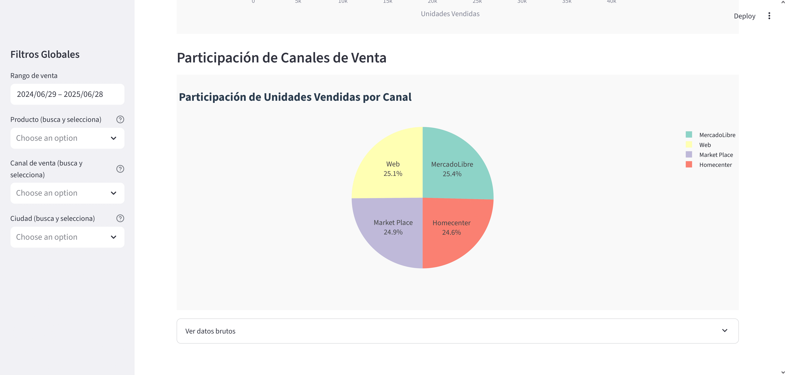

# 📊 Dashboard DW CMC Energy

## Descripción General

Este proyecto implementa un **dashboard interactivo** en Python usando [Streamlit](https://streamlit.io/) para visualizar y analizar datos de ventas de un ecommerce, almacenados en un Data Warehouse (DW) en PostgreSQL. El dashboard permite a los usuarios explorar métricas clave, tendencias y comparativas de ventas, márgenes y productos, con filtros avanzados y visualizaciones modernas.

---

## Finalidad

- **Monitorear el desempeño comercial** de la empresa en tiempo real.
- Analizar ventas, márgenes, productos destacados y tendencias por diferentes dimensiones (producto, canal, ciudad, fecha, etc.).
- Facilitar la toma de decisiones basada en datos, con visualizaciones claras y filtros flexibles.

---

## Requisitos Previos

- **Python 3.8+**
- **PostgreSQL** con el esquema de DW ya cargado (ver archivo `BackupDW.sql`).
- Acceso a la base de datos con las tablas y datos correspondientes.

---

## Recomendación: Crear un entorno virtual

Para evitar conflictos de dependencias y mantener tu entorno limpio, **se recomienda crear un entorno virtual** en la carpeta del proyecto:

```sh
# En la raíz del proyecto
python -m venv .venv
# Activar el entorno virtual en Windows
.venv\Scripts\activate
# (En Linux/Mac: source .venv/bin/activate)
```

---

## Instalación de librerías necesarias

Instala las siguientes librerías dentro del entorno virtual:

```sh
pip install streamlit pandas sqlalchemy psycopg2-binary plotly
```

---

## Archivos principales

- `dashboard_dw.py` — Código principal del dashboard.
- `DDL.sql` — Script de creación de tablas del DW.

---

## Ejecución

1. **Activa tu entorno virtual**:
    ```sh
    .venv\Scripts\activate
    ```
2. **Ejecuta el dashboard**:
    ```sh
    streamlit run dashboard_dw.py
    ```
3. **Abre el navegador** en la URL que te indique Streamlit (por defecto: http://localhost:8501).

---

## Visualizaciones Incluidas

Las siguientes gráficas se generan en el dashboard.

1. **Top 10 Productos Más Vendidos**  
   

2. **Ventas por Categoría**  
   

3. **Margen vs Volumen de Ventas (Productos)**  
   

4. **Comparativa de Ventas por Canal**  
   

5. **Tendencia de Ventas en el Tiempo**  
   

6. **Ventas por Ciudad**  
   

7. **Participación de Canales de Venta**  
   

---

## Funcionamiento Detallado

### 1. **Conexión a la Base de Datos**
El programa se conecta a PostgreSQL usando SQLAlchemy. Cambia la variable `DB_URL` si tu conexión es diferente.

### 2. **Filtros Laterales**
- **Rango de fechas:** Selecciona el periodo de análisis.
- **Producto, Canal, Ciudad:** Filtros con búsqueda rápida para seleccionar múltiples valores.
- Los filtros son opcionales (excepto la fecha), y el dashboard se actualiza dinámicamente según la selección.

### 3. **Consultas Dinámicas**
El dashboard arma la consulta SQL según los filtros seleccionados, trayendo solo los datos necesarios para las visualizaciones.

### 4. **Métricas Principales**
Se muestran las unidades vendidas, ingresos totales y margen total para el periodo y filtros seleccionados.

### 5. **Visualizaciones**
Cada gráfica se genera con Plotly y se muestra en Streamlit.  
- **Top 10 productos**: Siempre muestra los más vendidos, independiente del filtro de producto.
- **Ventas por categoría, canal, ciudad**: Permiten comparar el desempeño por diferentes dimensiones.
- **Margen vs volumen**: Relaciona la rentabilidad con la rotación de productos.
- **Tendencia temporal**: Muestra la evolución de las ventas.
- **Participación de canales**: Pie chart de la distribución de ventas por canal.
- **Satisfacción**: Si existe la columna, muestra el rating promedio por producto.
- **Detalle de datos**: Permite ver la tabla de datos brutos filtrados.

---

## Personalización

- Puedes modificar los colores, títulos y tipos de gráficas fácilmente en el código.
- Para agregar nuevas dimensiones o métricas, solo debes modificar la consulta SQL y agregar la visualización correspondiente.

---

## Notas

- Si tienes problemas de rendimiento, asegúrate de que tu base de datos esté indexada y que los filtros no traigan demasiados datos.
- Si agregas nuevas columnas o dimensiones, actualiza los filtros y las consultas en el código.

---

## Contacto

Para dudas o mejoras, contacta al desarrollador del dashboard.

---

## Cómo montar la base de datos en PostgreSQL

1. **Instala PostgreSQL**  
   Descarga e instala PostgreSQL desde [https://www.postgresql.org/download/](https://www.postgresql.org/download/).

2. **Crea la base de datos vacía**  
   Abre la terminal de PostgreSQL (psql) o usa PgAdmin y ejecuta:

   ```sql
   CREATE DATABASE ecommerce_dw;
   ```

3. **Restaura el backup del DW**  
   Si tienes el archivo `BackupDW` generado desde PgAdmin (por ejemplo, `BackupDW.backup`):

   - **Usando PgAdmin:**
     1. Haz clic derecho sobre la base de datos `ecommerce_dw` y selecciona **Restore...**
     2. En "Format", selecciona **Custom or tar**.
     3. En "Filename", selecciona tu archivo `BackupDW`.
     4. Haz clic en **Restore** y espera a que termine el proceso.

   - **Usando la terminal:**
     ```sh
     pg_restore -U postgres -d ecommerce_dw -1 BackupDW.backup
     ```
     > Cambia `postgres` por tu usuario y `BackupDW.backup` por la ruta y nombre de tu archivo.

4. **Verifica la carga de datos**  
   Asegúrate de que las tablas y datos estén correctamente restaurados en la base de datos.

5. **Configura la conexión en el dashboard**  
   Asegúrate de que la variable `DB_URL` en `dashboard_dw.py` tenga el usuario, contraseña y puerto correctos para tu instalación.

---
